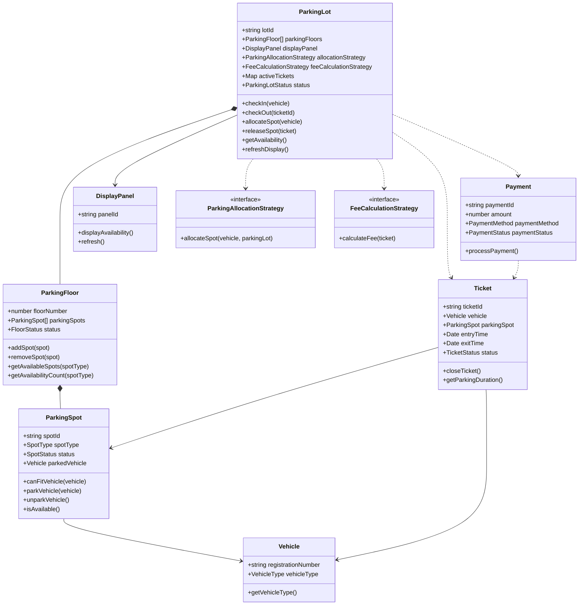

```mermaid
classDiagram

class ParkingLot {
    +string lotId
    +ParkingFloor[] parkingFloors
    +DisplayPanel displayPanel
    +ParkingAllocationStrategy allocationStrategy
    +FeeCalculationStrategy feeCalculationStrategy
    +Map activeTickets
    +ParkingLotStatus status

    +checkIn(vehicle)
    +checkOut(ticketId)
    +allocateSpot(vehicle)
    +releaseSpot(ticket)
    +getAvailability()
    +refreshDisplay()
}

class ParkingFloor {
    +number floorNumber
    +ParkingSpot[] parkingSpots
    +FloorStatus status

    +addSpot(spot)
    +removeSpot(spot)
    +getAvailableSpots(spotType)
    +getAvailabilityCount(spotType)
}

class ParkingSpot {
    +string spotId
    +SpotType spotType
    +SpotStatus status
    +Vehicle parkedVehicle

    +canFitVehicle(vehicle)
    +parkVehicle(vehicle)
    +unparkVehicle()
    +isAvailable()
}

class Vehicle {
    +string registrationNumber
    +VehicleType vehicleType

    +getVehicleType()
}

class Ticket {
    +string ticketId
    +Vehicle vehicle
    +ParkingSpot parkingSpot
    +Date entryTime
    +Date exitTime
    +TicketStatus status

    +closeTicket()
    +getParkingDuration()
}

class Payment {
    +string paymentId
    +number amount
    +PaymentMethod paymentMethod
    +PaymentStatus paymentStatus

    +processPayment()
}

class DisplayPanel {
    +string panelId

    +displayAvailability()
    +refresh()
}

class ParkingAllocationStrategy {
    <<interface>>
    +allocateSpot(vehicle, parkingLot)
}

class FeeCalculationStrategy {
    <<interface>>
    +calculateFee(ticket)
}

ParkingLot *-- ParkingFloor
ParkingFloor *-- ParkingSpot

ParkingSpot --> Vehicle
Ticket --> Vehicle
Ticket --> ParkingSpot

ParkingLot --> DisplayPanel
ParkingLot ..> ParkingAllocationStrategy
ParkingLot ..> FeeCalculationStrategy

ParkingLot ..> Ticket
ParkingLot ..> Payment
Payment ..> Ticket
```
