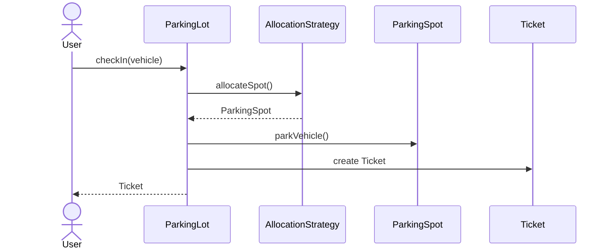
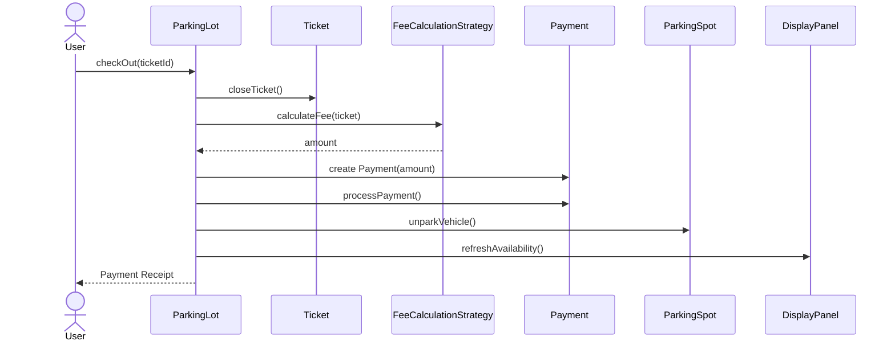

```
                                    Entry Gate Flow
```


```mermaid
sequenceDiagram
    actor User
    participant ParkingLot
    participant AllocationStrategy
    participant ParkingSpot
    participant Ticket

    User->>ParkingLot: checkIn(vehicle)

    ParkingLot->>AllocationStrategy: allocateSpot()

    AllocationStrategy-->>ParkingLot: ParkingSpot

    ParkingLot->>ParkingSpot: parkVehicle()

    ParkingLot->>Ticket: create Ticket

    ParkingLot-->>User: Ticket

```

```
                                    Exit Gate Flow
```


```mermaid
sequenceDiagram
    actor User
    participant ParkingLot
    participant Ticket
    participant FeeCalculationStrategy
    participant Payment
    participant ParkingSpot
    participant DisplayPanel

    User->>ParkingLot: checkOut(ticketId)

    ParkingLot->>Ticket: closeTicket()

    ParkingLot->>FeeCalculationStrategy: calculateFee(ticket)

    FeeCalculationStrategy-->>ParkingLot: amount

    ParkingLot->>Payment: create Payment(amount)

    ParkingLot->>Payment: processPayment()

    ParkingLot->>ParkingSpot: unparkVehicle()

    ParkingLot->>DisplayPanel: refreshAvailability()

    ParkingLot-->>User: Payment Receipt

```
